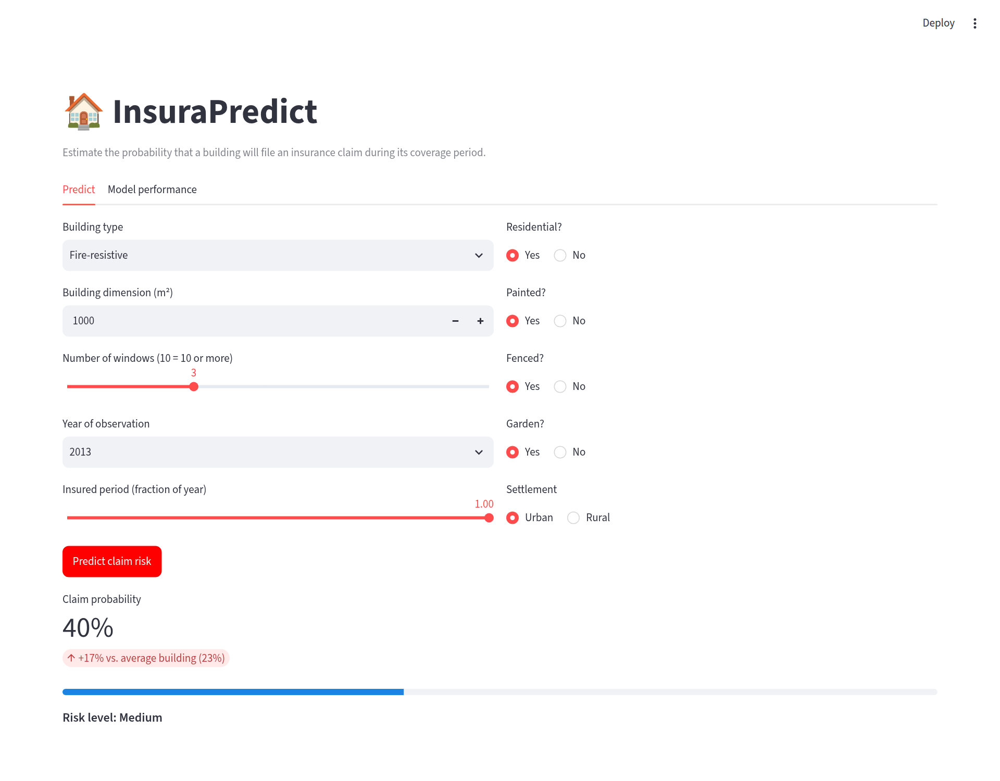
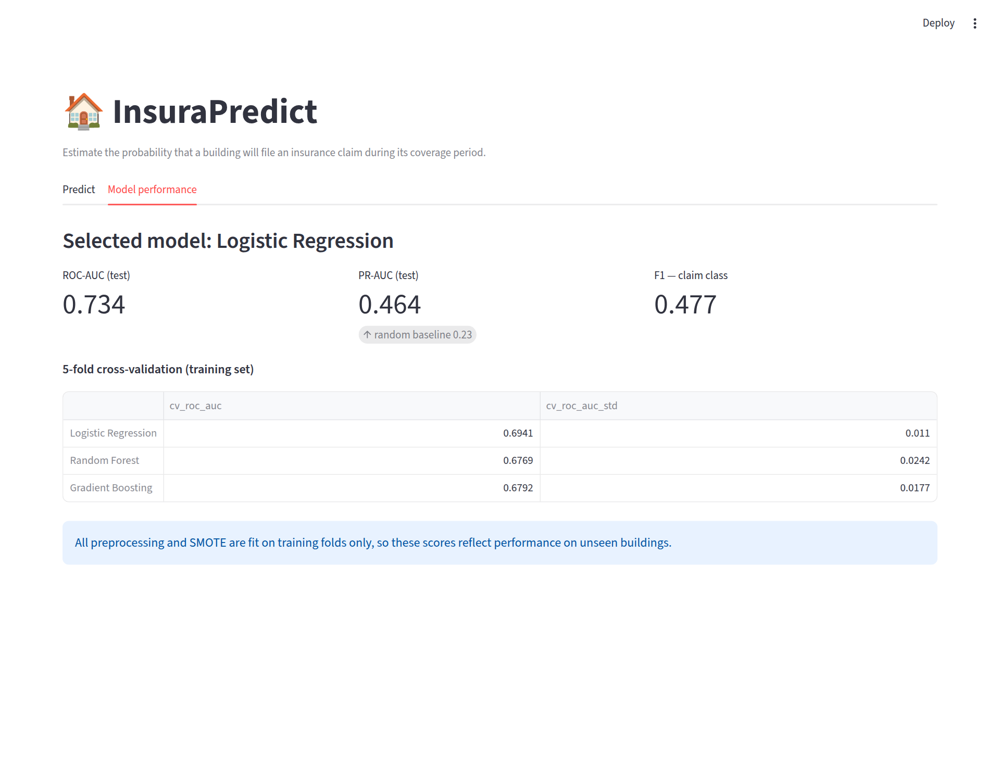

# 🏠 InsuraPredict: Building Insurance Claim Prediction

Predict whether a building will have an insurance claim during its coverage period, from its type, size, location and structural features. The model is served through an interactive **Streamlit** web app.

## 🖥️ Dashboard

| Claim risk prediction | Model performance |
|---|---|
|  |  |

## ✨ Features

- **Interactive predictor**: enter a building's characteristics and get its claim probability and risk level, compared with the average building.
- **Model performance tab**: held-out test metrics and a cross-validated comparison of the models.
- **Leak-free training pipeline**: imputation, outlier capping, encoding, scaling and SMOTE all run inside a single scikit-learn / imbalanced-learn pipeline.

## 📊 Dataset

4,970 buildings (after removing duplicates) with 10 features: year of observation, insured period, residential flag, painted / fenced / garden, urban vs. rural settlement, building dimension, building type and number of windows.
Target: `Claim` (22.5% positive, so the classes are imbalanced).

## 🔬 Method

1. **EDA**: distributions, class balance, correlations, feature importance ([Project1.ipynb](Project1.ipynb)).
2. **Split first**: stratified 80/20 train/test split, done before any preprocessing.
3. **Pipeline**: median / most-frequent imputation, IQR outlier capping, ordinal encoding and scaling, then **SMOTE** (applied to training folds only), then the model.
4. **Model selection**: Logistic Regression, Random Forest and Gradient Boosting compared with 5-fold stratified cross-validation on ROC-AUC.
5. **Evaluation**: on the untouched test set with its real class distribution.

## 🏆 Results

| Model | CV ROC-AUC |
|---|---|
| **Logistic Regression** (selected) | **0.694 ± 0.011** |
| Gradient Boosting | 0.679 ± 0.018 |
| Random Forest | 0.677 ± 0.024 |

**Held-out test set (Logistic Regression):**

| Metric | Score | Reference |
|---|---|---|
| ROC-AUC | 0.734 | 0.5 = random |
| PR-AUC | 0.464 | 0.225 = random |
| Recall (claim class) | 0.59 | |
| F1 (claim class) | 0.48 | |

### 💡 Lesson learned: fixing data leakage

An earlier version of this project reported **~92% accuracy**. That number came from data leakage: the minority class was upsampled *with replacement before* the train/test split, so copies of the same buildings appeared in both sets and the models were partly scored on rows they had memorized. Accuracy was also measured on an artificially balanced test set.

After the fix (split first, resample only inside the training folds, evaluate on the real distribution), the honest performance is a **ROC-AUC of 0.73**: a model that ranks risky buildings well above chance, though it is far from perfect. The features available (mostly coarse building attributes) limit how much can be predicted.

## 🚀 Run it locally

```bash
git clone https://github.com/badrioumayma/Assurance-Habitation-Pr-diction-Accidents..git
cd Assurance-Habitation-Pr-diction-Accidents.
python -m venv .venv && source .venv/bin/activate   # Windows: .venv\Scripts\activate
pip install -r requirements.txt

python src/train.py      # retrain (optional: a trained model is already in models/)
streamlit run app.py     # open http://localhost:8501
```

## 📁 Project structure

```
├── app.py               # Streamlit frontend
├── src/train.py         # Leak-free training pipeline
├── models/              # Trained model + metrics.json
├── Project1.ipynb       # Exploratory analysis
├── train_Insurance.csv  # Dataset
└── assets/              # Screenshots
```

## 🛠️ Tech stack

Python · pandas · scikit-learn · imbalanced-learn · Streamlit · matplotlib / seaborn

## 👥 Authors

- **Oumayma Badri**
- **Nasser Mohamed Amin**
